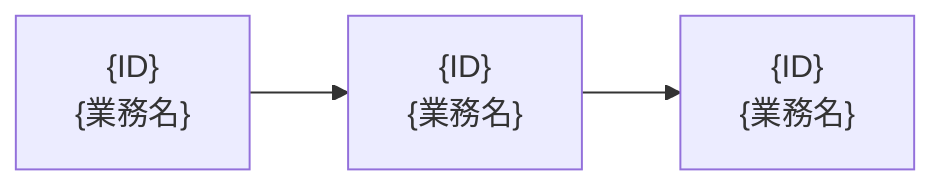
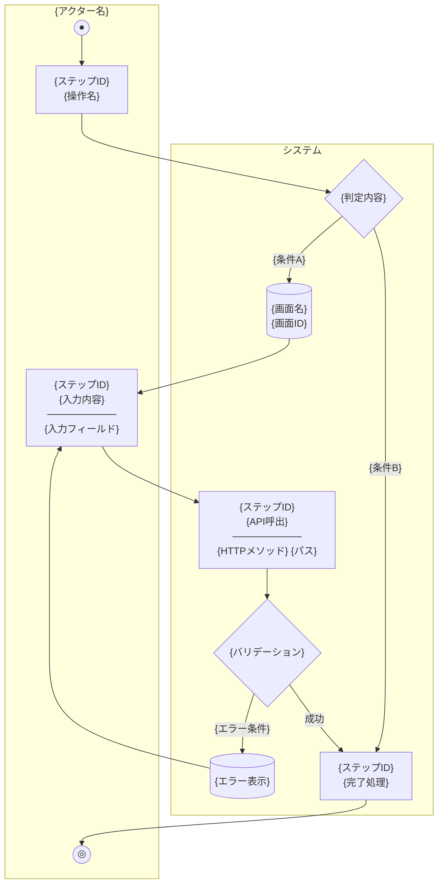
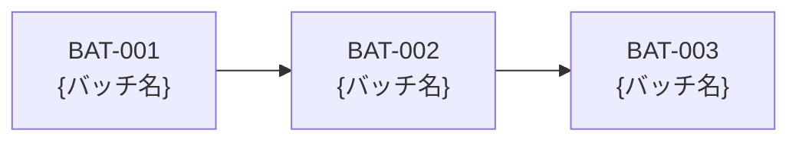

# 要件定義書テンプレート

本文書は、要件定義書を生成AIで作成する際のインプットテンプレートである。
各セクションの `<!-- [指示] ... -->` コメントに従って、プロジェクト固有の内容を記載すること。

## 未定義境界保持ルール

以下のルールは、原資料に存在しない情報を過度に補完しないための共通ルールである。

| 状態 | 意味 |
|---|---|
| 明記 | 原資料に直接記載がある |
| 推定 | 原資料から合理的に推測できるが、直接の記載はない |
| 未記載 | 原資料に記載がない、または判定できない |
| 対象外 | 原資料で対象外、または初期リリース対象外と判断できる |
| 要確認 | OCR不良、記述矛盾、情報不足などにより確認が必要 |

- `未記載` の項目は勝手に補完せず、`TBD` や注記として残すこと。
- `推定` の項目は確定事項として書かず、推定であることを明示すること。
- 原資料に存在しない章や項目であっても、削除を優先せず、必要に応じて `未記載` または `対象外` として残すこと。

---

# 1. 背景・目的

<!-- cc-sdd:section=background -->

## 1-1. 本プロジェクトの背景

<!-- [指示] プロジェクトが生まれた背景・経緯を記載してください。組織やビジネスの課題感、現行業務の問題点などを簡潔に説明します。 -->

{{project_overview.background_summary}}

### 課題

<!-- [指示] 本プロジェクトで解決すべき課題を一覧で記載してください。各課題に対して求められる対応策も記載します。 -->

<!-- cc-sdd:block type=table path=project_overview.challenges columns="@index;challenge;expected_response" -->
| # | 課題 | 求められる対応 |
|---|------|----------------|
| 1 | {現状の課題を記載} | {課題に対する対応策を記載} |
| 2 | {現状の課題を記載} | {課題に対する対応策を記載} |

## 1-2. 本プロジェクトの目的

### 目的

<!-- [指示] プロジェクトの目的を1〜2文で端的に記載し、具体的な目的を箇条書きで列挙してください。 -->

{{project_overview.purpose_summary}}

<!-- cc-sdd:block type=list path=project_overview.purposes field=text -->
- {具体的な目的1}
- {具体的な目的2}
- {具体的な目的3}

### 提供価値

<!-- [指示] 本システムがユーザーや組織に提供する価値を記載してください。他の手段と比較した優位性なども含めます。 -->

<!-- cc-sdd:block type=list path=project_overview.provided_values field=text -->
- {提供する価値1}
- {提供する価値2}

### 想定ユースケース

<!-- [指示] 代表的なユースケースを列挙してください。「誰が」「何をする」の形式で記載します。 -->

<!-- cc-sdd:block type=list path=business_requirements.actors renderer=actor_use_case -->
- {ユーザー種別}が{操作内容}する。
- {ユーザー種別}が{操作内容}する。
- {ユーザー種別}が{操作内容}する。

### 達成目標

<!-- [指示] プロジェクトの達成目標を記載してください。目標ごとに達成を判断するための指標も定義します。 -->

<!-- cc-sdd:block type=table provider=target_goals columns="@index;goal;metric" -->
| # | 目標 | 指標 |
|---|------|------|
| 1 | {達成目標} | {達成を判断する指標} |
| 2 | {達成目標} | {達成を判断する指標} |

## 1-3. 用語定義

<!-- [指示] 本文書群で使用する用語とその定義を記載してください。システム固有の用語、業務用語、技術用語のうち定義が必要なものを網羅します。略語がある場合はその正式名称も記載してください。 -->

<!-- cc-sdd:block type=table path=project_overview.glossary columns="term;definition" -->
| 用語 | 定義 |
|------|------|
| {用語} | {用語の定義を記載} |
| {用語} | {用語の定義を記載} |

---

# 2. 業務要件

<!-- cc-sdd:section=business -->

## 2-1. 業務概要

<!-- [指示] システムが対象とする業務領域を一覧で記載してください。各領域の概要を簡潔に記載します。 -->

{{document_control.system_name}}は{{functional_requirements.system_scope}}であり、以下の業務領域を対象とする。

<!-- cc-sdd:block type=table path=business_requirements.business_domains columns="domain_name;summary" -->
| 業務領域 | 概要 |
|----------|------|
| {業務領域名} | {業務領域の概要} |
| {業務領域名} | {業務領域の概要} |

## 2-2. 業務一覧

<!-- [指示] 業務領域ごとにサブセクションを作成し、各業務の業務ID・業務名・概要・アクターを一覧で記載してください。業務IDはID体系に従って付番します。 -->

<!-- cc-sdd:repeat path=business_requirements.business_domains alias=domain -->
### {{domain.domain_name}}業務

<!-- cc-sdd:block type=table provider=business_domain_items columns="business_id;business_name;summary;actors;status|unknown_as_tbd;source_basis;missing_information;follow_up_needed|unknown_as_tbd" -->
| 業務ID | 業務名 | 概要 | アクター | 状態 | 根拠 | 不足情報 | 後続検討要否 |
|--------|--------|------|----------|------|------|----------|--------------|
| {ID} | {業務名} | {業務の概要を1文で記載} | {実施するアクター} | {明記 / 推定 / 未記載 / 対象外 / 要確認} | {原資料の根拠} | {不足している情報} | {要 / 不要} |

<!-- cc-sdd:end -->

## 2-3. 業務フロー

<!-- [指示] 主要な業務フローごとにサブセクションを作成し、テキスト形式の簡易フローと処理詳細を記載してください。詳細なMermaid図は「2-3別紙. 業務フロー図」セクションに記載します。 -->

<!-- cc-sdd:repeat path=business_requirements.business_flows alias=flow -->
### 2-3-{{@index}}. {{flow.flow_name}}

<!-- cc-sdd:block type=code renderer=flow_summary -->
```
[{アクター}] → {操作1} → {操作2} → {操作3} → {完了状態}
```

**処理詳細:**
<!-- cc-sdd:block type=list path=flow.steps renderer=flow_step -->
1. {ステップ1の説明}
2. {ステップ2の説明}
3. {ステップ3の説明}

<!-- cc-sdd:end -->

## 2-4. アクター定義

<!-- [指示] システムに関わるアクター（利用者の種別）を定義してください。アクターの説明には、権限範囲や利用可能な機能の概要を含めます。 -->

<!-- cc-sdd:block type=table path=business_requirements.actors columns="actor_name;description" -->
| アクター | 説明 |
|----------|------|
| {アクター名} | {アクターの説明と権限範囲} |
| {アクター名} | {アクターの説明と権限範囲} |

---

# 2-2別紙. 業務一覧（詳細）

<!-- cc-sdd:section=business-list -->

本セクションは「2-2. 業務一覧」を、詳細な表形式でまとめた別紙である。

### ID体系

<!-- [指示] 業務IDの命名規則を記載してください。大分類ID（業務領域）と連番の組み合わせで構成します。 -->

業務一覧のIDは以下の規則で付番する。

```
業務ID = 大分類ID（業務領域）+ 小分類連番（2桁）
例: {XX}01 = {XX}（{業務領域名}）+ 01（{業務名}）
```

### 業務一覧表

<!-- 
[指示] すべての業務を1つの表に集約して記載してください。各列の記載内容は以下の通りです。

- 業務ID: ID体系に基づく一意のID
- 大分類ID: 業務領域を示す2文字のコード
- 大分類（業務領域）: 業務領域名
- 小分類ID: 業務IDと同一（業務単位の一意識別子）
- 小分類（業務名）: 業務の名称
- 業務の内容: 業務の詳細な説明。入力項目や処理内容を含む
- 機能要件: バリデーションルール、チェック処理、制約条件など
- 処理区分: 「画面操作」「API呼出」「バッチ処理」など処理の種別
- 後続処理: この業務の完了後に続く業務のID・業務名
- 実施者: 業務を実施するアクター（「2-4. アクター定義」を参照）
- 実施方式: 対応する画面ID（SCR-XXX）やUI要素の説明
- 実行タイミング: 「随時」「日次」「月次」などの実行頻度
- 備考: 補足事項、例外条件、注意点など
-->

<!-- cc-sdd:block type=table provider=business_detail_rows columns="business_id;domain_code;domain_name;small_id;business_name;business_content;functional_requirement;processing_type;next_process;actor;execution_mode;timing;remarks;status|unknown_as_tbd;source_basis;missing_information;follow_up_needed|unknown_as_tbd" -->
| 業務ID | 大分類ID | 大分類（業務領域） | 小分類ID | 小分類（業務名） | 業務の内容 | 機能要件 | 処理区分 | 後続処理 | 実施者 | 実施方式 | 実行タイミング | 備考 | 状態 | 根拠 | 不足情報 | 後続検討要否 |
|--------|----------|-------------------|----------|-----------------|-----------|---------|---------|---------|--------|---------|--------------|------|------|------|----------|--------------|
| {ID} | {大分類} | {業務領域名} | {ID} | {業務名} | {業務の詳細な内容} | {バリデーションルール・制約条件} | {処理区分} | {後続業務ID（業務名）} | {実施者} | {画面ID等} | {実行タイミング} | {備考} | {明記 / 推定 / 未記載 / 対象外 / 要確認} | {原資料の根拠} | {不足している情報} | {要 / 不要} |

<!-- [指示] すべての業務を網羅するまで行を追加してください。 -->

### 処理区分の定義

<!-- [指示] 業務一覧表で使用する処理区分の定義を記載してください。 -->

| 処理区分 | 説明 |
|---------|------|
| {処理区分名} | {処理区分の説明} |

### 実施方式の補足

<!-- [指示] 業務一覧表で使用する実施方式の補足説明を記載してください。 -->

| 実施方式 | 説明 |
|---------|------|
| {実施方式名} | {実施方式の説明} |

### 業務間の関連（後続処理の流れ）

<!-- [指示] 業務間の関連（後続処理の流れ）をMermaid flowchart形式で記載してください。業務IDと業務名をノードとし、後続処理の方向を矢印で表現します。 -->



<!-- [指示] すべての業務間の関連を網羅してください。 -->

---

# 2-3別紙. 業務フロー図

<!-- cc-sdd:section=business-flow -->

本セクションは「2-3. 業務フロー」を、スイムレーン形式のフロー図として詳細化した別紙である。

### 凡例

<!-- [指示] フロー図で使用する記号の凡例を記載してください。Mermaid flowchart の記法に合わせて統一します。 -->

```
●          : 始点
◎          : 終点
[処理名]    : ユーザー操作（画面操作）
[[処理名]]  : システム処理
{判定}      : 分岐・判定
[(画面名)]  : 画面表示
```

| 記号 | 意味 |
|------|------|
| 実線矢印 (→) | 業務の流れ |
| 破線テキスト | ユーザーの操作内容・補足 |
| ◇ 菱形 | 分岐判定 |

---

<!-- 
[指示] 以下のテンプレートを業務フローの数だけ繰り返してください。
1つの業務フローにつき以下を記載します:
- 業務フロー概要表（フローID、フロー名、関連業務ID、アクター）
- Mermaid flowchart TD 形式のスイムレーン図（ACTOR と SYSTEM のサブグラフ）
- ステップ詳細表（ステップID、ステップ名、アクター、画面/API、処理内容）

Mermaid 図の作成ルール:
- subgraph ACTOR["{アクター名}"] でユーザー操作を配置
- subgraph SYSTEM["システム"] でシステム処理を配置
- START(("●")) で始点、END1(("◎")) で終点を表現
- 分岐は {"判定内容"} で菱形ノードを使用
- 画面表示は [("画面名<br/>画面ID")] で円柱ノードを使用
- 処理ノードには "{ステップID}<br/>{処理名}<br/>──────────<br/>{補足情報}" の形式で記載
- エラー時の分岐は -- "エラー条件" --> で表現
-->

### BF-{ID}: {業務フロー名}

| 業務フローID | BF-{ID} |
|-------------|----------|
| 業務フロー名 | {業務フロー名} |
| 関連業務ID | {関連する業務ID} |
| アクター | {主要アクター} |



#### ステップ詳細

<!-- [指示] フロー図の各ステップについて、詳細な処理内容を表形式で記載してください。 -->

| ステップID | ステップ名 | アクター | 画面/API | 処理内容 |
|-----------|-----------|----------|---------|----------|
| {ステップID} | {ステップ名} | {ユーザー or システム} | {画面ID or APIパス or -} | {処理内容の説明} |
| - | {システム内部処理名} | システム | - | {内部処理の説明} |

---

<!-- [指示] 上記テンプレートを業務フローの数だけ繰り返してください。 -->

### 業務フロー一覧（索引）

<!-- [指示] すべての業務フローの索引を一覧表で記載してください。 -->

| フローID | フロー名 | 関連業務ID | アクター |
|----------|----------|-----------|----------|
| BF-{ID} | {フロー名} | {関連業務ID} | {アクター} |

---

# 3. 機能要件

<!-- cc-sdd:section=functional -->

## 3-1. システム概要（システム対象範囲）

### システム構成

<!-- [指示] システムの全体構成をテキスト図またはMermaid図で記載してください。各コンポーネント（フロントエンド、バックエンド、データベース等）の関係と通信方式、ポート番号などを含めます。 -->

<!-- cc-sdd:block type=code renderer=system_architecture -->
```
┌─────────────────────────────────────────────────────┐
│                   {実行環境名}                         │
│                                                      │
│  ┌──────────┐    ┌──────────────┐    ┌────────────┐ │
│  │{FE名}     │    │  {BE名}      │    │ {DB名}     │ │
│  │Port:{XXXX}│───→│ Port:{XXXX}  │───→│ Port:{XXXX}│ │
│  └──────────┘    └──────────────┘    └────────────┘ │
└─────────────────────────────────────────────────────┘
```

### 技術スタック

<!-- [指示] 使用する技術スタックをレイヤーごとに記載してください。技術名とバージョンを明記します。 -->

<!-- cc-sdd:block type=table path=functional_requirements.technology_stack columns="layer;product_name;version" -->
| レイヤー | 技術 | バージョン |
|----------|------|------------|
| フロントエンド | {フレームワーク名} | {バージョン} |
| UIフレームワーク | {ライブラリ名} | {バージョン} |
| バックエンド | {言語 + フレームワーク名} | {バージョン} |
| データアクセス | {ORM / クエリビルダー名} | {バージョン} |
| データベース | {DBMS名} | {バージョン} |
| マイグレーション | {ツール名} | {バージョン} |
| ビルド | {ビルドツール名} | {バージョン} |
| E2Eテスト | {テストフレームワーク名} | {バージョン} |
| コンテナ | {コンテナ技術名} | {バージョン} |

### 動作モード

<!-- [指示] システムの動作モードや環境固有の設定を記載してください。レンダリング方式、プロキシ設定、タイムゾーン、ロケールなどを含みます。 -->

- **レンダリング方式**: {{functional_requirements.runtime_modes.rendering_mode}}
- **API プロキシ**: {{functional_requirements.runtime_modes.api_proxy}}
- **タイムゾーン**: {{functional_requirements.runtime_modes.timezone}}
- **ロケール**: {{functional_requirements.runtime_modes.locale}}

## 3-2. 機能一覧

### ID体系

<!-- [指示] 機能IDの命名規則を記載してください。大分類ID・中分類ID・小分類IDの組み合わせで構成します。 -->

機能IDは以下の規則で付番する。

```
機能ID = 大分類ID（2文字）+ 中分類ID（2桁）+ 小分類ID（2桁）
例: {XX}0101 = {XX}（{大分類の名称}）+ 01（{中分類の名称}）+ 01（{小分類の名称}）
```

**大分類ID一覧:**

<!-- [指示] 業務領域ごとの大分類IDを定義してください。 -->

<!-- cc-sdd:block type=table provider=domain_rows columns="domain_code;domain_name" -->
| 大分類ID | 業務領域 |
|----------|----------|
| {XX} | {業務領域名} |

**難易度:**

<!-- [指示] 機能の実装難易度の区分S(とても複雑)～E(とても簡単)を定義してください。プロジェクトの基準に合わせて調整します。 -->

<!-- cc-sdd:block type=table provider=difficulty_definitions columns="code;name;description" -->
| 記号 | 難易度 | 説明 |
|------|--------|------|
| E | とても簡単 | {基準の説明} |
| D | 簡単 | {基準の説明} |
| C | やや簡単 | {基準の説明} |
| B | やや複雑 | {基準の説明} |
| A | 複雑 | {基準の説明} |
| S | とても複雑 | {基準の説明} |

### 機能一覧表

<!-- 
[指示] すべての機能を一覧表で記載してください。各列の記載内容は以下の通りです。

- 機能ID: ID体系に基づく一意の機能ID
- 大分類ID: 業務領域を示す2文字のコード
- 大分類（業務領域）: 大分類の名称
- 中分類ID: 中分類の2桁連番
- 中分類（業務名）: 中分類の名称
- 小分類ID: 小分類の2桁連番
- 小分類（機能名）: 小分類の名称
- 処理区分: 処理区分
- 機能名称: 機能の名称
- 機能要件: 機能の要件を1〜2文で説明
- 難易度: S / A / B / C / D / E
- 備考: 認証要否、前提条件、注意事項など
-->

| 機能ID | 大分類ID | 大分類（業務領域） | 中分類ID | 中分類（業務名） | 小分類ID | 小分類（機能名） | 機能名称 | 処理区分 | 機能要件 | 難易度 | 備考 | 状態 | 根拠 | 不足情報 | 後続検討要否 |
|--------|----------|-------------------|----------|-----------------|----------|----------|----------|----------|--------|------|------|------|----------|--------------|
| {ID} | {XX} | {業務領域名} | {NN} | {中分類名} | {NN} | {小分類名} | {機能名称} | {処理区分} | {機能要件の説明} | {S/A/B/C/D/E} | {備考} | {明記 / 推定 / 未記載 / 対象外 / 要確認} | {原資料の根拠} | {不足している情報} | {要 / 不要} |

<!-- [指示] すべての機能を網羅するまで行を追加してください。 -->

## 3-3. 対象ユーザ

<!-- [指示] システムの対象ユーザーを種別ごとに記載してください。各ユーザー種別が利用可能な機能の範囲も明記します。 -->

<!-- cc-sdd:block type=table provider=actors_with_functions columns="actor_name;description;available_functions" -->
| ユーザー種別 | 説明 | 利用可能機能 |
|--------------|------|--------------|
| {ユーザー種別} | {種別の説明} | {利用可能な機能の範囲} |

---

# 4. 画面要件

<!-- cc-sdd:section=screens -->

## 4-1. 画面一覧

<!-- [指示] システムの全画面を一覧で記載してください。画面ID・画面名・URLパス・認証要否・概要を網羅します。 -->

<!-- cc-sdd:block type=table provider=screen_rows columns="screen_id;screen_name;path;auth_required|unknown_as_tbd;summary;status|unknown_as_tbd;source_basis;missing_information;follow_up_needed|unknown_as_tbd" -->
| 画面ID | 画面名 | パス | 認証要否 | 概要 | 状態 | 根拠 | 不足情報 | 後続検討要否 |
|--------|--------|------|----------|------|------|------|----------|--------------|
| SCR-{NNN} | {画面名} | {URLパス} | {要/不要/要（条件）} | {画面の概要} | {明記 / 推定 / 未記載 / 対象外 / 要確認} | {原資料の根拠} | {不足している情報} | {要 / 不要} |

<!-- [指示] すべての画面を網羅するまで行を追加してください。 -->

## 4-2. 共通レイアウト

<!-- [指示] 全画面で共通して使用されるレイアウト要素（ヘッダー、フッター、サイドバー等）を記載してください。各要素の表示条件・遷移先・動作を定義します。 -->

### ヘッダー（全画面共通）

| 要素 | 表示条件 | 遷移先 | 動作 |
|------|----------|--------|------|
| {要素名} | {常時 / 認証済み時 / 未認証時 等} | {遷移先パス} | {動作の説明} |

<!-- [指示] フッターやサイドバーなど他の共通要素がある場合は同様のサブセクションを追加してください。 -->

## 4-3. 画面仕様

<!-- 
[指示] 各画面の詳細仕様を以下の形式で記載してください。画面一覧（4-1）に記載した画面ごとにサブセクションを作成します。

各画面仕様には以下を含めてください:
- URL: 画面のURLパス
- 認証: 認証要否と追加条件（本人のみ、投稿者のみ等）
- 構成要素: 画面を構成するUI要素の一覧（フォーム、ボタン、リスト等）
- API呼出: 画面が呼び出すAPIエンドポイント
- 成功時: 処理成功時の動作（遷移先、メッセージ表示等）
- エラー処理: HTTPステータスコードごとのエラー処理方法
- クライアントバリデーション: フロントエンドで実施する入力検証（該当する場合）
-->

<!-- cc-sdd:repeat path=screen_requirements.screens alias=screen -->
### {{screen.screen_id}}: {{screen.screen_name}}

- **URL**: `{{screen.path}}`
- **認証**: {{screen.auth_required|unknown_as_tbd}} / {{screen.auth_condition}}
- **構成要素**:
  - TBD
- **API呼出**: `TBD`
- **成功時**: TBD
- **エラー処理**: TBD

<!-- cc-sdd:end -->

## 4-4. 画面遷移図

<!-- [指示] 全画面間の遷移関係をテキスト図またはMermaid図で記載してください。主要な遷移パスを矢印で表現し、画面IDを明記します。 -->

```
                    ┌──────────┐
                    │ {画面名}  │
                    │ SCR-{NNN}│
                    └────┬─────┘
                         │
            ┌────────────┼───────────────┐
            ▼            ▼               ▼
     ┌──────────┐ ┌──────────┐   ┌──────────┐
     │ {画面名}  │ │ {画面名}  │   │ {画面名}  │
     │ SCR-{NNN}│ │ SCR-{NNN}│   │ SCR-{NNN}│
     └──────────┘ └──────────┘   └──────────┘
```

---

<!-- cc-sdd:if path=report_requirements.reports mode=nonempty -->
# 5. 帳票要件

<!-- cc-sdd:section=reports -->

## 5-1. 帳票一覧

<!-- [指示] システムが出力するすべての帳票（PDF、Excel、CSV等）を一覧で記載してください。帳票ID・帳票名・出力形式・出力タイミング・概要を網羅します。帳票が存在しない、または原資料に記載がない場合でも、本セクションを削除せず、`状態` を `未記載` または `対象外` として残してください。 -->

| 帳票ID | 帳票名 | 出力形式 | 出力タイミング | 概要 | 状態 | 根拠 | 不足情報 | 後続検討要否 |
|--------|--------|----------|--------------|------|------|------|----------|--------------|
| RPT-{NNN} | {帳票名} | {PDF / Excel / CSV 等} | {画面操作 / バッチ / スケジュール 等} | {帳票の概要} | {明記 / 推定 / 未記載 / 対象外 / 要確認} | {原資料の根拠} | {不足している情報} | {要 / 不要} |

<!-- [指示] すべての帳票を網羅するまで行を追加してください。 -->

## 5-2. 帳票仕様

<!-- 
[指示] 帳票一覧（5-1）に記載した各帳票について、詳細仕様をサブセクションとして記載してください。

各帳票仕様には以下を含めてください:
- 帳票ID・帳票名
- 出力形式: PDF / Excel / CSV 等
- 出力タイミング: ユーザー操作 / バッチ / スケジュール
- 出力条件: 出力時のパラメータやフィルタ条件
- ページ設定: 用紙サイズ、向き、余白（PDF の場合）
- レイアウト: 帳票のレイアウト概要（ヘッダー、明細部、フッターの構成）
- 出力項目一覧: 各項目のデータソース・書式・表示ルール
- ソート順: 明細行の並び順
- 改ページ条件: 改ページが発生する条件（該当する場合）
- 出力上限: 1回の出力で許容する最大件数・最大ファイルサイズ
-->

### RPT-{NNN}: {帳票名}

- **帳票ID**: RPT-{NNN}
- **出力形式**: {PDF / Excel / CSV 等}
- **出力タイミング**: {画面操作 / バッチ / スケジュール}
- **出力条件**:
  | パラメータ | 必須 | 型 | 説明 |
  |-----------|------|-----|------|
  | {パラメータ名} | {要/任意} | {型} | {パラメータの説明} |
- **ページ設定**: {用紙サイズ} / {向き（縦/横）} / 余白 {上下左右mm}
- **レイアウト**:
  - ヘッダー: {帳票タイトル、出力日時、出力条件等}
  - 明細部: {明細行の構成}
  - フッター: {ページ番号、合計行等}
- **出力項目一覧**:
  | # | 項目名 | データソース | 書式 | 備考 |
  |---|--------|------------|------|------|
  | 1 | {項目名} | {テーブル.カラム / 計算式 等} | {日付書式 / 数値書式 等} | {備考} |
- **ソート順**: {ソートキーと昇順/降順}
- **改ページ条件**: {改ページが発生する条件}
- **出力上限**: {最大件数 / 最大ファイルサイズ}

<!-- [指示] すべての帳票について同様のサブセクションを繰り返してください。 -->

## 5-3. 帳票共通仕様

<!-- [指示] 帳票全体で共通する仕様を記載してください。共通ヘッダー/フッター、文字コード、日付書式、数値書式などを含めます。 -->

| 項目 | 仕様 |
|------|------|
| 文字コード | {UTF-8 等} |
| 日付書式 | {yyyy/MM/dd 等} |
| 数値書式 | {カンマ区切り、小数点以下桁数 等} |
| 共通ヘッダー | {帳票タイトル、出力日時 等の共通要素} |
| 共通フッター | {ページ番号の書式 等} |
| ファイル名規則 | {帳票名}_{出力日時}.{拡張子} 等 |

---

<!-- cc-sdd:end -->
# 6. IF要件（API）

<!-- cc-sdd:section=api -->

## 6-1. API一覧

<!-- [指示] システムが提供するすべてのAPIを一覧で記載してください。API ID・HTTPメソッド・エンドポイント・認証要否・概要を網羅します。 -->

{システム名}は{フロントエンド技術}と{バックエンド技術}間を REST API で通信する。
全 API はプレフィックス `{APIプレフィックス}` 配下に配置される。

<!-- cc-sdd:block type=table provider=api_rows columns="api_id;method;path;auth_required|unknown_as_tbd;summary;status|unknown_as_tbd;source_basis;missing_information;follow_up_needed|unknown_as_tbd" -->
| API-ID | HTTPメソッド | エンドポイント | 認証要否 | 概要 | 状態 | 根拠 | 不足情報 | 後続検討要否 |
|--------|-------------|---------------|----------|------|------|------|----------|--------------|
| API-{XXX}-{NNN} | {GET/POST/PUT/DELETE} | `{エンドポイントパス}` | {要/不要} | {APIの概要} | {明記 / 推定 / 未記載 / 対象外 / 要確認} | {原資料の根拠} | {不足している情報} | {要 / 不要} |

<!-- [指示] すべてのAPIを網羅するまで行を追加してください。 -->

## 6-2. API仕様詳細

<!-- 
[指示] 各APIの詳細仕様を以下の形式で記載してください。API一覧（5-1）に記載したAPIごとにサブセクションを作成します。

各API仕様には以下を含めてください:
- メソッド: HTTPメソッド
- パス: エンドポイントパス（パスパラメータを含む）
- 認証: 認証要否と追加条件
- リクエストボディ: JSON形式でリクエストの構造を記載（該当する場合）
- クエリパラメータ: クエリパラメータの一覧（該当する場合）
- バリデーション: 各フィールドのバリデーションルール（該当する場合）
- レスポンス: 成功時のHTTPステータスコードとレスポンスボディ（JSON形式）
- エラー: 想定されるエラーのHTTPステータスコードと条件
- 備考: 補足事項（副作用、特殊な動作等）
-->

<!-- cc-sdd:repeat path=api_requirements.apis alias=api -->
### API-{{@index}}: {{api.domain_name}} {{api.method}} {{api.path}}

- **メソッド**: {{api.method}}
- **パス**: `{{api.path}}`
- **認証**: {{api.auth_required|unknown_as_tbd}}
- **リクエストボディ**:
<!-- cc-sdd:block type=code renderer=api_request_json -->
  ```json
  {
    "{フィールド名}": "{型}"
  }
  ```
- **バリデーション**:
  | フィールド | ルール |
  |------------|--------|
  | {フィールド名} | {バリデーションルール} |
- **レスポンス（200）**:
<!-- cc-sdd:block type=code renderer=api_response_json -->
  ```json
  {
    "{フィールド名}": "{型 or サンプル値}"
  }
  ```
- **エラー**: TBD
- **備考**: TBD

<!-- cc-sdd:end -->

## 6-3. エラーレスポンス共通仕様

<!-- [指示] API全体で共通するエラーレスポンスの形式を定義してください。HTTPステータスコードごとの意味とレスポンス形式を記載します。 -->

| HTTPステータス | 意味 | レスポンス形式 |
|---------------|------|---------------|
| 400 | バリデーションエラー | `{ "messages": ["エラーメッセージ1", "エラーメッセージ2"] }` |
| 401 | 未認証 | {レスポンス形式} |
| 403 | 権限不足 | {レスポンス形式} |
| 404 | リソース不在 | {レスポンス形式} |
| 409 | 競合（重複） | {レスポンス形式} |
| 500 | サーバーエラー | {レスポンス形式} |

---

<!-- cc-sdd:if path=batch_requirements.batches mode=nonempty -->
# 7. バッチ要件

<!-- cc-sdd:section=batch -->

## 7-1. バッチ一覧

<!-- [指示] システムで実行するすべてのバッチ処理を一覧で記載してください。バッチID・バッチ名・実行タイミング・実行スケジュール・概要を網羅します。バッチ処理が存在しない、または原資料に記載がない場合でも、本セクションを削除せず、`状態` を `未記載` または `対象外` として残してください。 -->

| バッチID | バッチ名 | 実行タイミング | 実行スケジュール | 概要 | 状態 | 根拠 | 不足情報 | 後続検討要否 |
|---------|---------|--------------|----------------|------|------|------|----------|--------------|
| BAT-{NNN} | {バッチ名} | {スケジュール / 手動 / イベント} | {cron式 or 手動 or トリガー条件} | {バッチの概要} | {明記 / 推定 / 未記載 / 対象外 / 要確認} | {原資料の根拠} | {不足している情報} | {要 / 不要} |

<!-- [指示] すべてのバッチ処理を網羅するまで行を追加してください。 -->

## 7-2. バッチ仕様

<!-- 
[指示] バッチ一覧（7-1）に記載した各バッチについて、詳細仕様をサブセクションとして記載してください。

各バッチ仕様には以下を含めてください:
- バッチID・バッチ名
- 実行タイミング: スケジュール / 手動 / イベントトリガー
- 実行スケジュール: cron式またはトリガー条件の詳細
- 処理概要: バッチが行う処理の概要
- 入力: 入力データ（テーブル、ファイル、API等）
- 出力: 出力データ（テーブル更新、ファイル出力、通知等）
- 処理フロー: 処理ステップの流れ
- 処理件数・性能: 想定データ量と許容処理時間
- 排他制御: 同時実行の制御方針
- エラーハンドリング: エラー時の処理（リトライ、スキップ、中断等）
- リカバリ方針: 異常終了時の復旧手順
- 通知: 処理完了・異常終了時の通知先と通知方法
-->

### BAT-{NNN}: {バッチ名}

- **バッチID**: BAT-{NNN}
- **実行タイミング**: {スケジュール / 手動 / イベントトリガー}
- **実行スケジュール**: {cron式 / 手動実行のトリガー / イベント条件}
- **処理概要**: {バッチが行う処理の概要を1〜3文で記載}
- **入力**:
  | 入力元 | 種別 | 説明 |
  |--------|------|------|
  | {テーブル名 / ファイルパス / APIエンドポイント} | {テーブル / ファイル / API} | {入力データの説明} |
- **出力**:
  | 出力先 | 種別 | 説明 |
  |--------|------|------|
  | {テーブル名 / ファイルパス / 通知先} | {テーブル更新 / ファイル出力 / メール通知 等} | {出力データの説明} |
- **処理フロー**:
  1. {ステップ1の説明}
  2. {ステップ2の説明}
  3. {ステップ3の説明}
- **処理件数・性能**:
  | 項目 | 値 |
  |------|-----|
  | 想定処理件数 | {件/回} |
  | 許容処理時間 | {分/時間} |
  | コミット単位 | {件数 or 一括} |
- **排他制御**: {同時実行可否、ロック方式、多重起動防止の方法}
- **エラーハンドリング**:
  | エラー種別 | 処理方針 |
  |-----------|---------|
  | {データ不整合} | {スキップして続行 / 処理中断 等} |
  | {外部連携エラー} | {リトライ{N}回後に中断 等} |
  | {タイムアウト} | {処理中断 等} |
- **リカバリ方針**: {異常終了時の復旧手順を記載}
- **通知**:
  | 条件 | 通知先 | 通知方法 |
  |------|--------|---------|
  | 正常完了 | {通知先} | {メール / Slack / ログ 等} |
  | 異常終了 | {通知先} | {メール / Slack / ログ 等} |

<!-- [指示] すべてのバッチについて同様のサブセクションを繰り返してください。 -->

## 7-3. バッチ共通仕様

<!-- [指示] バッチ全体で共通する仕様を記載してください。実行基盤、ログ出力、監視方法などを含めます。 -->

| 項目 | 仕様 |
|------|------|
| 実行基盤 | {ジョブスケジューラ名 / cron / Spring Batch 等} |
| ログ出力先 | {ログファイルパス / ログ管理サービス} |
| ログレベル | {INFO / ERROR 等の基準} |
| 多重起動防止 | {ロックファイル / DBフラグ / ジョブスケジューラ機能 等} |
| タイムアウト | {デフォルトのタイムアウト時間} |
| リトライ方針 | {デフォルトのリトライ回数・間隔} |
| 文字コード | {UTF-8 等} |

## 7-4. バッチ実行順序・依存関係

<!-- [指示] バッチ間の実行順序や依存関係がある場合、Mermaid図または一覧で記載してください。依存関係がない場合も削除せず、`依存関係なし`、`未記載`、`対象外` のいずれかを明記してください。 -->



| バッチID | 先行バッチ | 後続バッチ | 依存条件 |
|---------|-----------|-----------|---------|
| BAT-{NNN} | {先行バッチID or なし} | {後続バッチID or なし} | {正常完了後に実行 等} |

---

<!-- cc-sdd:end -->
# 8. データ要件

<!-- cc-sdd:section=data -->

## 8-1. データベース概要

<!-- [指示] 使用するデータベースの基本情報を記載してください。 -->

- **DBMS**: {{data_requirements.database.dbms}}
- **データベース名**: `{{data_requirements.database.database_name}}`
- **マイグレーション**: {{data_requirements.database.migration_tool}}
- **タイムゾーン**: {{data_requirements.database.timezone}}

## 8-2. テーブル一覧

<!-- [指示] システムで使用するすべてのテーブルを一覧で記載してください。テーブル名・概要・削除方式（物理削除/論理削除）を明記します。 -->

<!-- cc-sdd:block type=table provider=data_table_rows columns="table_name;summary;delete_label;status|unknown_as_tbd;source_basis;missing_information;follow_up_needed|unknown_as_tbd" -->
| テーブル名 | 概要 | 削除方式 | 状態 | 根拠 | 不足情報 | 後続検討要否 |
|------------|------|----------|------|------|----------|--------------|
| {テーブル名} | {テーブルの概要} | {物理削除 / 論理削除（`{フラグカラム名}`）} | {明記 / 推定 / 未記載 / 対象外 / 要確認} | {原資料の根拠} | {不足している情報} | {要 / 不要} |

<!-- [指示] すべてのテーブルを網羅するまで行を追加してください。 -->

## 8-3. テーブル定義

<!-- 
[指示] テーブル一覧（6-2）に記載した各テーブルについて、カラム定義をサブセクションとして記載してください。

各テーブル定義には以下を含めてください:
- テーブルの説明（1文）
- カラム一覧表（カラム名、データ型、NULL許容、デフォルト値、制約、説明）
- インデックス情報（該当する場合）
- 外部キー情報（該当する場合）
-->

<!-- cc-sdd:repeat path=data_requirements.tables alias=table -->
### {{table.table_name}} テーブル

{{table.summary}}

<!-- cc-sdd:block type=table path=table.columns columns="name;data_type;nullable;default_value;constraints;description" -->
| カラム名 | データ型 | NULL許容 | デフォルト値 | 制約 | 説明 |
|----------|----------|----------|-------------|------|------|
| {カラム名} | {データ型} | {YES/NO} | {デフォルト値 or -} | {PK/FK/UNIQUE 等 or -} | {カラムの説明} |

**インデックス**: TBD

**外部キー**: TBD

<!-- cc-sdd:end -->

## 8-4. ER図

<!-- [指示] テーブル間のリレーションをテキスト形式のER図またはMermaid erDiagram で記載してください。主キー・外部キー・カーディナリティ（1:N 等）を明記します。 -->

```
┌─────────────────┐
│   {テーブル名}    │
├─────────────────┤
│ *{PK}           │───┐
│  {カラム名}      │   │
│  {カラム名}      │   │
└─────────────────┘   │
         │             │
         │ 1:N         │ 1:N
         ▼             ▼
┌─────────────────┐  ┌─────────────────┐
│   {テーブル名}    │  │   {テーブル名}    │
├─────────────────┤  ├─────────────────┤
│ *{PK}           │  │ *{PK}           │
│  {FK}      (FK) │  │  {FK}      (FK) │
└─────────────────┘  └─────────────────┘
```

**リレーション:**

<!-- [指示] テーブル間のリレーションを箇条書きで記載してください。 -->

- `{テーブル名}` 1 : N `{テーブル名}`（`{外部キーカラム名}`）

## 8-5. トリガー・関数

<!-- [指示] データベースで使用するトリガーや関数がある場合に記載してください。関数の目的・定義（SQL）・適用テーブルを明記します。該当なしの場合も削除せず、`未記載` または `対象外` として残してください。 -->

### {関数名}

{関数の目的を1文で説明}

```sql
-- {関数の定義SQLを記載}
```

**適用テーブル**: {トリガーが適用されるテーブル名}

## 8-6. マイグレーション管理

<!-- [指示] マイグレーションファイルの一覧と、マイグレーション操作コマンドを記載してください。 -->

| マイグレーションファイル | 概要 |
|-------------------------|------|
| `{ファイル名}` | {マイグレーションの概要} |

### マイグレーション操作コマンド

| 操作 | コマンド |
|------|---------|
| マイグレーション実行 | `{コマンド}` |
| クリーン（全削除） | `{コマンド}` |
| 情報表示 | `{コマンド}` |

## 8-7. 初期データ（ローカル開発用）

<!-- [指示] ローカル開発・テスト用の初期データがある場合に記載してください。テーブルごとに投入するデータの概要を記載します。パスワードなどのセンシティブ情報は平文で記載するか、ハッシュ化済みかを明記してください。該当なしの場合も削除せず、`未記載` または `対象外` として残してください。 -->

### {テーブル名}

| {カラム1} | {カラム2} | {カラム3} | 備考 |
|-----------|-----------|-----------|------|
| {値} | {値} | {値} | {備考} |

## 8-8. データ分類と想定規模

<!-- [指示] 各テーブルのデータ分類（マスタ/トランザクション）と想定されるデータ増加特性を記載してください。 -->

| データ分類 | テーブル | 種別 | 想定特性 |
|------------|----------|------|----------|
| {分類名} | {テーブル名} | {マスタ / トランザクション} | {データ増加の想定特性} |

---

# 9. 非機能要件

<!-- cc-sdd:section=non-functional -->

## 9-1. 認証・認可

### 認証方式

<!-- [指示] システムで採用する認証方式を記載してください。認証方式の種類、セッション管理方法、認証処理の実装コンポーネント、フロントエンドでの状態管理方法を含めます。 -->

<!-- cc-sdd:block type=kvtable rows="non_functional_requirements.auth.authentication_method;non_functional_requirements.auth.session_management;non_functional_requirements.auth.authorization_rules|auth_rule_summary;non_functional_requirements.auth.auth_provider;non_functional_requirements.auth.frontend_state_management;non_functional_requirements.auth.principal_fields" -->
| 項目 | 内容 |
|------|------|
| 認証方式 | {セッション認証 / JWT / OAuth2 等} |
| セッション管理 | {セッション管理の実装方式} |
| 認証フィルター | {認証フィルターの実装クラス名・対象エンドポイント} |
| 認証プロバイダー | {認証プロバイダーの実装クラス名・認証方法} |
| フロントエンド状態管理 | {状態管理ライブラリ名・保持するデータ・永続化方法} |
| ログインプリンシパル | {認証後に保持するユーザー情報のフィールド} |

### 認可ルール

<!-- [指示] APIエンドポイントごとの認証要否と追加の認可条件を一覧で記載してください。「6. IF要件（API）」のAPI一覧と整合させます。 -->

<!-- cc-sdd:block type=table provider=authorization_rules columns="resource;auth_required|unknown_as_tbd;condition;status|unknown_as_tbd;source_basis;missing_information;follow_up_needed|unknown_as_tbd" -->
| リソース | 認証要否 | 追加条件 | 状態 | 根拠 | 不足情報 | 後続検討要否 |
|----------|----------|----------|------|------|----------|--------------|
| `{HTTPメソッド} {エンドポイント}` | {要/不要} | {本人のみ / 投稿者のみ / - 等} | {明記 / 推定 / 未記載 / 対象外 / 要確認} | {原資料の根拠} | {不足している情報} | {要 / 不要} |

<!-- [指示] すべてのエンドポイントを網羅するまで行を追加してください。 -->

### パスワードポリシー

<!-- [指示] パスワードに関するポリシーを記載してください。文字数制限、必須文字種、ハッシュ方式を含めます。パスワード認証を使用しない場合も削除せず、`対象外` として残してください。 -->

<!-- cc-sdd:block type=kvtable rows="non_functional_requirements.auth.password_policy.min_length;non_functional_requirements.auth.password_policy.required_character_types;non_functional_requirements.auth.password_policy.hash_method" -->
| 項目 | ルール |
|------|--------|
| 文字数 | {最小文字数}〜{最大文字数}文字 |
| 必須文字種 | {必須文字種のルール} |
| ハッシュ方式 | {ハッシュアルゴリズム名} |

## 9-2. セキュリティ

<!-- [指示] システムのセキュリティ対策を項目ごとに記載してください。パスワード保存、CSRF対策、CORS設定、入力検証、アクセス制御などを含めます。 -->

<!-- cc-sdd:block type=table path=non_functional_requirements.security columns="item;description" -->
| 項目 | 対応内容 |
|------|----------|
| パスワード保存 | {ハッシュ化方式} |
| CSRF | {CSRF対策の実装方法} |
| CORS | {CORS設定の方針} |
| セッション管理 | {セッション管理の実装方式} |
| 入力検証 | {入力検証の実装方式（フレームワーク名等）} |
| {その他の対策項目} | {対応内容} |

## 9-3. エラーハンドリング

### バックエンド

<!-- [指示] バックエンドのエラーハンドリング方式を記載してください。共通例外ハンドラーやエラーメッセージ管理の仕組みを含めます。 -->

| コンポーネント | 役割 |
|---------------|------|
| {コンポーネント名} | {役割の説明} |

### バリデーションメッセージ一覧

<!-- [指示] システムで使用するバリデーションエラーメッセージを一覧で記載してください。メッセージID・メッセージ内容・対象機能を含めます。 -->

| メッセージID | メッセージ内容 | 対象 |
|-------------|---------------|------|
| {ID} | {エラーメッセージの内容} | {対象となる機能・画面} |

<!-- [指示] すべてのバリデーションメッセージを網羅するまで行を追加してください。 -->

### フロントエンド

<!-- [指示] フロントエンドでのエラー処理方針を記載してください。HTTPステータスコードごとの処理内容を定義します。 -->

| エラー種別 | 処理内容 |
|------------|----------|
| 400 | {バリデーションエラー時の処理} |
| 401 | {未認証時の処理} |
| 403 | {権限不足時の処理} |
| 404 | {リソース不在時の処理} |
| その他 | {想定外エラー時の処理} |

## 9-4. 実行環境

### サービス構成

<!-- [指示] システムを構成するサービス（コンテナ、サーバー等）の一覧を記載してください。各サービスのイメージ/ビルド方法、ポート番号、役割を含めます。 -->

<!-- cc-sdd:block type=table provider=service_rows columns="service_name;image_or_build;port;role" -->
| サービス名 | イメージ/ビルド | ポート | 役割 |
|-----------|---------------|--------|------|
| {サービス名} | {イメージ名 or ビルド方法} | {ポート番号} | {役割} |

### 環境変数・設定

<!-- [指示] システムの動作に必要な環境変数や設定値を記載してください。センシティブな情報（パスワード等）は実際の値ではなく、環境変数名やプレースホルダーを記載してください。 -->

| 項目 | 値 |
|------|-----|
| DB接続先 | `{JDBC URL等}` |
| DBユーザー | `{ユーザー名 or 環境変数名}` |
| DBパスワード | `{環境変数名}` |
| タイムゾーン | {タイムゾーン} |
| ロケール | {ロケール} |

## 9-5. テスト

### ユニットテスト（バックエンド）

<!-- [指示] バックエンドのユニットテスト環境を記載してください。フレームワーク、テスト用DB、実行方法を含めます。 -->

| 項目 | 内容 |
|------|------|
| フレームワーク | {テストフレームワーク名} |
| テスト用DB | {テスト用DBの構成} |
| 実行方法 | `{テスト実行コマンド}` |
| マイグレーション | `{テスト用マイグレーションコマンド}` |

### E2Eテスト

<!-- [指示] E2Eテスト環境を記載してください。フレームワーク、使用ブラウザ、ベースURL、テストファイルの配置場所を含めます。E2Eテストを実施しない場合も削除せず、`対象外` として残してください。 -->

| 項目 | 内容 |
|------|------|
| フレームワーク | {E2Eテストフレームワーク名} |
| ブラウザ | {使用ブラウザ} |
| ベースURL | `{ベースURL}` |
| テストファイル | `{テストファイルの配置パス}` |

### E2Eテストケース一覧

<!-- [指示] E2Eテストのテストケースを一覧で記載してください。テストファイル名と対象機能を対応づけます。 -->

| テストファイル | 対象機能 |
|---------------|----------|
| `{テストファイル名}` | {対象機能} |

### テストヘルパー

<!-- [指示] テストで使用するヘルパー関数を一覧で記載してください。該当なしの場合も削除せず、`未記載` または `対象外` として残してください。 -->

| 関数 | 用途 |
|------|------|
| `{関数名}()` | {ヘルパー関数の用途} |

## 9-6. 運用・保守

<!-- [指示] システムの運用・保守に関する方針を箇条書きで記載してください。ディレクトリ構成・命名規則の方針、DBスキーマ変更の管理方法、エラーメッセージの管理方法などを含めます。 -->

<!-- cc-sdd:block type=list provider=operation_policies field=text -->
- {運用・保守の方針1}
- {運用・保守の方針2}
- {運用・保守の方針3}

## 9-7. ビルド・デプロイ

### バックエンド

<!-- [指示] バックエンドのビルド・デプロイに関する情報を記載してください。 -->

<!-- cc-sdd:block type=table provider=backend_build_items columns="item;value" -->
| 項目 | 内容 |
|------|------|
| ビルドツール | {ビルドツール名} |
| {その他の項目} | {内容} |

### フロントエンド

<!-- [指示] フロントエンドのビルド・デプロイに関する情報を記載してください。 -->

<!-- cc-sdd:block type=table provider=frontend_build_items columns="item;value" -->
| 項目 | 内容 |
|------|------|
| パッケージマネージャー | {パッケージマネージャー名} |
| 開発サーバー | `{コマンド}` |
| ビルド | `{コマンド}` |
| Lint | `{コマンド}` |

---

<!-- cc-sdd:if path=migration_requirements.migration_needed mode=nonempty -->
# 10. 移行要件

<!-- cc-sdd:section=migration -->

<!-- [指示] 既存システムからの移行が発生する場合に本セクションを記載してください。新規開発で移行が不要な場合も、本セクション全体を削除せず、`対象外` または `未記載` として残してください。 -->

## 10-1. 移行概要

<!-- [指示] 移行の全体像を記載してください。移行元システムの概要、移行の目的・方針、移行方式を含めます。 -->

### 移行元システム

| 項目 | 内容 |
|------|------|
| システム名 | {移行元システム名} |
| 稼働環境 | {オンプレミス / クラウド / サービス名 等} |
| 技術スタック | {使用言語・フレームワーク・DB等} |
| 運用開始時期 | {YYYY年MM月} |
| 現行データ規模 | {ユーザー数、レコード数、データ容量等の目安} |

### 移行方式

<!-- [指示] 移行方式を選択し、その方式を採用する理由を記載してください。 -->

| 項目 | 内容 |
|------|------|
| 移行方式 | {ビッグバン / 段階移行 / 並行稼働 等} |
| 採用理由 | {移行方式を選択した理由} |
| 移行期間 | {想定する移行期間} |
| 並行稼働期間 | {並行稼働する場合の期間。該当なしの場合は「-」} |

## 10-2. 移行対象

<!-- [指示] 移行対象を「データ移行」「機能移行」「インフラ移行」の観点で分類し、それぞれの対象範囲と移行可否を記載してください。 -->

### データ移行対象

| # | 移行元 | 移行先 | データ概要 | 想定件数 | 移行可否 | 状態 | 根拠 | 不足情報 | 備考 |
|---|--------|--------|-----------|---------|---------|------|------|----------|------|
| 1 | {移行元テーブル/ファイル} | {移行先テーブル} | {データの概要} | {想定件数} | {対象 / 対象外} | {明記 / 推定 / 未記載 / 対象外 / 要確認} | {原資料の根拠} | {不足している情報} | {備考} |

<!-- [指示] すべてのデータ移行対象を網羅するまで行を追加してください。 -->

### 機能移行対象

<!-- [指示] 現行システムの機能が新システムでどのように引き継がれるかを記載してください。 -->

| # | 現行機能 | 新システム対応 | 移行方針 | 備考 |
|---|---------|--------------|---------|------|
| 1 | {現行機能名} | {対応する新機能名 / 廃止 / 代替手段} | {そのまま移行 / 再実装 / 廃止 等} | {備考} |

### インフラ移行対象

<!-- [指示] インフラ面の移行対象がある場合に記載してください。サーバー、ネットワーク、ミドルウェア、外部連携先などを含めます。該当なしの場合も削除せず、`未記載` または `対象外` として残してください。 -->

| # | 移行対象 | 現行環境 | 新環境 | 移行方針 |
|---|---------|---------|--------|---------|
| 1 | {対象名} | {現行の構成} | {新しい構成} | {移行方針} |

## 10-3. データ移行仕様

<!-- [指示] データ移行の詳細仕様を記載してください。テーブル/エンティティごとのマッピングルール、データ変換ルール、クレンジングルールを含めます。 -->

### マッピング定義

<!-- [指示] 移行元と移行先のカラム単位の対応関係を記載してください。移行対象テーブルごとにサブセクションを作成します。 -->

#### {移行先テーブル名}

| # | 移行先カラム | データ型 | 移行元カラム | 変換ルール | デフォルト値 | 備考 |
|---|------------|---------|------------|-----------|------------|------|
| 1 | {カラム名} | {データ型} | {移行元テーブル.カラム名} | {変換ルールの説明} | {移行元にデータがない場合のデフォルト値} | {備考} |

<!-- [指示] すべての移行先テーブルについて同様のサブセクションを繰り返してください。 -->

### データクレンジングルール

<!-- [指示] 移行前にデータクレンジング（不正データの補正・除外）が必要な場合に記載してください。該当なしの場合も削除せず、`未記載` または `対象外` として残してください。 -->

| # | 対象データ | クレンジング条件 | 処理方針 |
|---|-----------|----------------|---------|
| 1 | {対象テーブル.カラム} | {不正データの条件} | {補正ルール / 除外 / エラー出力 等} |

## 10-4. 移行スケジュール

<!-- [指示] 移行の主要マイルストーンとスケジュールを記載してください。 -->

| フェーズ | 内容 | 開始日 | 終了日 | 備考 |
|---------|------|--------|-------|------|
| 移行設計 | {移行仕様の策定、ツール開発} | {YYYY/MM/DD} | {YYYY/MM/DD} | |
| 移行ツール開発 | {移行スクリプト・ツールの開発} | {YYYY/MM/DD} | {YYYY/MM/DD} | |
| 移行リハーサル（1回目） | {テスト環境での移行検証} | {YYYY/MM/DD} | {YYYY/MM/DD} | |
| 移行リハーサル（2回目） | {本番同等環境での移行検証} | {YYYY/MM/DD} | {YYYY/MM/DD} | |
| 本番移行 | {本番環境への移行実施} | {YYYY/MM/DD} | {YYYY/MM/DD} | |
| 移行後検証 | {移行データの整合性確認} | {YYYY/MM/DD} | {YYYY/MM/DD} | |

## 10-5. 移行手順

<!-- [指示] 本番移行当日の手順を時系列で記載してください。作業者、所要時間、確認事項を含めます。 -->

| # | 作業内容 | 作業者 | 所要時間（見込） | 確認事項 |
|---|---------|--------|----------------|---------|
| 1 | {作業内容} | {作業者} | {所要時間} | {確認すべきポイント} |

## 10-6. 切り替え判定・ロールバック

### 切り替え判定基準

<!-- [指示] 新システムへの切り替えを実行するかどうかを判断するための基準を記載してください。 -->

| # | 判定項目 | 判定基準 | 確認方法 |
|---|---------|---------|---------|
| 1 | データ移行完了 | {全件移行完了、件数一致} | {件数突合、サンプルチェック} |
| 2 | 機能動作確認 | {主要機能の正常動作} | {移行後テストケースの実行} |
| 3 | 性能確認 | {許容レスポンスタイム以内} | {性能テストの実行} |

### ロールバック方針

<!-- [指示] 移行後に重大な問題が発覚した場合のロールバック方針を記載してください。 -->

| 項目 | 内容 |
|------|------|
| ロールバック判断基準 | {ロールバックを決定する条件} |
| ロールバック手順 | {旧システムへの切り戻し手順の概要} |
| ロールバック期限 | {ロールバック可能な期限} |
| データ同期方針 | {ロールバック時の新システム投入データの扱い} |

## 10-7. 移行リスク

<!-- [指示] 移行に伴うリスクと対策を記載してください。 -->

| # | リスク | 影響度 | 発生可能性 | 対策 |
|---|--------|--------|-----------|------|
| 1 | {リスクの内容} | {高/中/低} | {高/中/低} | {リスク対策の内容} |


<!-- cc-sdd:end -->

---

# 11. 追加要件 / 特記事項

## 11-1. 文書管理情報

### 改訂履歴

<!-- cc-sdd:block type=table path=document_control.revision_history columns="version;date;description;author;approver" -->
| 版 | 変更日 | 変更内容 | 変更者 | 承認者 |
|---|---|---|---|---|
| {版} | {変更日} | {変更内容} | {変更者} | {承認者} |

### アジェンダ

<!-- cc-sdd:block type=list path=document_control.agenda renderer=agenda_line -->
- {アジェンダ項目}

### 想定読者

<!-- cc-sdd:block type=list path=project_overview.target_readers field=role -->
- {想定読者}

### OCR / layout warnings

<!-- cc-sdd:block type=list provider=notes renderer=notes -->
- {警告}

## 11-2. 未定義境界一覧

<!-- cc-sdd:block type=list provider=unresolved renderer=unresolved -->
- {未解決項目}

### 変換できなかった項目とその理由

| ID | 項目 | 変換できなかった内容 | 理由 | 影響 | 後続検討要否 | 備考 |
|---|---|---|---|---|---|---|
| UNR-001 | {項目名} | {変換できなかった内容} | {原資料に記載なし / OCR不明 / 構造化不可 / 判定不能} | {要件 / 設計 / 実装 / テストへの影響} | {要 / 不要} | {備考} |

### 未記載事項一覧

| ID | 項目 | 章 | 未記載内容 | 理由 | 影響 | 後続検討要否 | 備考 |
|---|---|---|---|---|---|---|---|
| UNK-001 | {項目名} | {章番号} | {未記載の内容} | {原資料に記載なし / OCR不明 / 判定不能} | {要件 / 設計 / 実装 / テストへの影響} | {要 / 不要} | {備考} |

### 推定事項一覧

| ID | 項目 | 推定内容 | 推定理由 | 根拠 | 妥当性 | 後続確認要否 | 備考 |
|---|---|---|---|---|---|---|---|
| ASM-001 | {項目名} | {推定内容} | {推定理由} | {原資料の根拠} | {高 / 中 / 低} | {要 / 不要} | {備考} |

### 要確認事項一覧

| ID | 項目 | 確認したいこと | なぜ必要か | 状態 | 備考 |
|---|---|---|---|---|---|
| Q-001 | {項目名} | {確認したい内容} | {確認が必要な理由} | {未確認} | {備考} |

